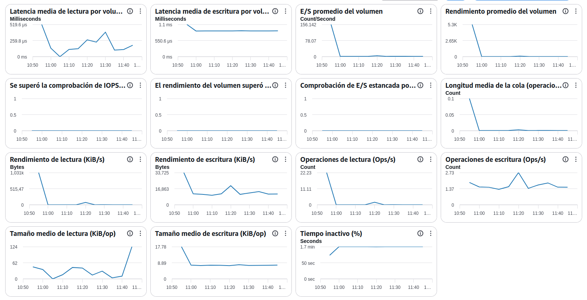

# Manual básico de supervisión de Amazon EBS (Elastic Block Store)

## AWS EBS Monitoring: Guía de Métricas para Operaciones

### Introducción

La supervisión de **Amazon EBS (Elastic Block Store)** permite controlar el rendimiento y la capacidad de los volúmenes de almacenamiento utilizados por las instancias EC2.

**Objetivos del administrador SysOps:**

- Detectar cuellos de botella de almacenamiento.
- Validar que el volumen dispone de IOPS suficientes.
- Identificar problemas de latencia.
- Optimizar costes de almacenamiento.
- Anticipar necesidades de escalado.

---

## 1. Latencia media de lectura (Read Latency)

### ¿Qué mide?

Tiempo medio que tarda EBS en completar una operación de lectura.

### Valores recomendados

| Latencia | Estado     |
| -------- | ---------- |
| < 5 ms   | Excelente  |
| 5-10 ms  | Buena      |
| 10-20 ms | Vigilancia |
| > 20 ms  | Crítica    |

### Qué revisar

- Saturación del volumen.
- Aplicaciones con muchas lecturas.
- Falta de caché.
- Tamaño insuficiente del volumen.

### Penalizaciones

- Consultas más lentas.
- Mayor tiempo de acceso a ficheros.
- Degradación del rendimiento de aplicaciones.

---

## 2. Latencia media de escritura (Write Latency)

### ¿Qué mide?

Tiempo medio necesario para completar operaciones de escritura.

### Valores recomendados

| Latencia | Estado     |
| -------- | ---------- |
| < 5 ms   | Excelente  |
| 5-10 ms  | Buena      |
| 10-20 ms | Vigilancia |
| > 20 ms  | Crítica    |

### Qué revisar

- Procesos batch.
- Bases de datos muy activas.
- Volumen insuficiente para la carga.

### Penalizaciones

- Lentitud en transacciones.
- Aumento del tiempo de respuesta.
- Posibles bloqueos de aplicación.

---

## 3. E/S promedio del volumen (Volume Avg Queue Length)

### ¿Qué mide?

Número medio de operaciones esperando acceso al volumen.

### Valores recomendados

| Valor | Estado     |
| ----- | ---------- |
| 0-1   | Normal     |
| 1-5   | Vigilancia |
| 5-10  | Alto       |
| >10   | Crítico    |

### Qué revisar

- Saturación de IOPS.
- Aumento repentino de actividad.
- Procesos concurrentes.

### Penalizaciones

- Incremento de latencia.
- Cuellos de botella en almacenamiento.

---

## 4. Rendimiento promedio del volumen (Volume Throughput)

### ¿Qué mide?

Cantidad total de datos transferidos por segundo.

### Valores óptimos

Dependen del tipo de volumen:

- gp3: hasta 1.000 MiB/s.
- io2: hasta 4.000 MiB/s.
- io2 Block Express: hasta 4.000 MiB/s.

### Qué revisar

- Copias masivas.
- Backups.
- Procesos de migración.

### Penalizaciones

- Saturación del throughput contratado.
- Lentitud generalizada.

---

## 5. Comprobación de IOPS superada (Volume IOPS Exceeded Check)

### ¿Qué mide?

Indica si el volumen ha alcanzado o superado el límite de IOPS disponible.

### Valores recomendados

| Valor | Estado             |
| ----- | ------------------ |
| 0     | Correcto           |
| 1     | Problema detectado |

### Qué revisar

- Configuración del volumen.
- IOPS provisionadas.
- Carga generada por aplicaciones.

### Penalizaciones

- Aumento de latencia.
- Operaciones pendientes.
- Necesidad de aumentar IOPS.

---

## 6. Comprobación de rendimiento superada (Volume Throughput Exceeded Check)

### ¿Qué mide?

Detecta si el volumen alcanzó el límite máximo de throughput.

### Valores recomendados

| Valor | Estado     |
| ----- | ---------- |
| 0     | Normal     |
| 1     | Saturación |

### Qué revisar

- Procesos intensivos de copia.
- Operaciones batch.
- Bases de datos con gran volumen de datos.

### Penalizaciones

- Transferencias lentas.
- Tiempo elevado en operaciones de almacenamiento.

---

## 7. Comprobación de E/S estancada (Stalled I/O Check)

### ¿Qué mide?

Detecta operaciones bloqueadas o que no progresan correctamente.

### Valores recomendados

| Valor | Estado   |
| ----- | -------- |
| 0     | Correcto |
| 1     | Problema |

### Qué revisar

- Estado del volumen.
- Estado de la instancia EC2.
- Problemas de sistema operativo.

### Penalizaciones

- Errores de aplicación.
- Riesgo de indisponibilidad.

---

## 8. Longitud media de la cola de operaciones

### ¿Qué mide?

Número de solicitudes pendientes de ser procesadas por el volumen.

### Valores recomendados

Idealmente cercana a cero.

### Qué revisar

- Saturación de disco.
- Actividad excesiva.
- Insuficientes IOPS provisionadas.

### Penalizaciones

- Mayores latencias.
- Menor rendimiento global.

---

## 9. Rendimiento de lectura (KiB/s)

### ¿Qué mide?

Cantidad de datos leídos por segundo.

### Qué revisar

- Consultas intensivas.
- Procesos ETL.
- Escaneos completos.

### Penalizaciones

- Consumo elevado de throughput.

---

## 10. Rendimiento de escritura (KiB/s)

### ¿Qué mide?

Cantidad de datos escritos por segundo.

### Qué revisar

- Logs.
- Importaciones de datos.
- Procesos batch.

### Penalizaciones

- Saturación del throughput.
- Latencias elevadas.

---

## 11. Operaciones de lectura (Read Ops/s)

### ¿Qué mide?

Número de operaciones de lectura realizadas cada segundo.

### Qué revisar

- Cargas analíticas.
- Consultas frecuentes.
- Aplicaciones muy dependientes de lectura.

### Penalizaciones

- Consumo elevado de IOPS.

---

## 12. Operaciones de escritura (Write Ops/s)

### ¿Qué mide?

Número de operaciones de escritura por segundo.

### Qué revisar

- Bases de datos.
- Sistemas de logs.
- Replicaciones.

### Penalizaciones

- Agotamiento de IOPS.
- Incremento de latencia.

---

## 13. Tamaño medio de lectura (KiB/op)

### ¿Qué mide?

Cantidad media de datos transferidos en cada operación de lectura.

### Interpretación

- Tamaños pequeños → muchas operaciones.
- Tamaños grandes → menos IOPS y más throughput.

### Qué revisar

Patrones de acceso de la aplicación.

---

## 14. Tamaño medio de escritura (KiB/op)

### ¿Qué mide?

Cantidad media de datos escritos por operación.

### Qué revisar

- Configuración de bases de datos.
- Aplicaciones que generan ficheros.

### Penalizaciones

Escrituras demasiado pequeñas generan mayor consumo de IOPS.

---

## 15. Tiempo inactivo (%)

### ¿Qué mide?

Porcentaje de tiempo durante el cual el volumen no recibe operaciones.

### Valores orientativos

| Valor  | Interpretación |
| ------ | -------------- |
| >70%   | Infrautilizado |
| 30-70% | Uso normal     |
| <30%   | Uso intensivo  |

### Qué revisar

- Volúmenes sobredimensionados.
- Recursos infrautilizados.

### Penalizaciones

Ninguna a nivel técnico, pero puede indicar costes innecesarios.

---

## Alertas recomendadas para producción

| Métrica                   | Alarma                               |
| ------------------------- | ------------------------------------ |
| Read Latency              | >15 ms durante 15 min                |
| Write Latency             | >15 ms durante 15 min                |
| Queue Length              | >5 sostenido                         |
| IOPS Exceeded Check       | Valor = 1                            |
| Throughput Exceeded Check | Valor = 1                            |
| Stalled I/O Check         | Valor = 1                            |
| Tiempo inactivo           | Revisión si >90% de forma permanente |

---

## Categorización

### Indicadores de rendimiento

- Read Latency
- Write Latency
- Read Ops/s
- Write Ops/s
- Read Throughput
- Write Throughput
- Queue Length

### Indicadores de capacidad

- IOPS Exceeded Check
- Throughput Exceeded Check
- Stalled I/O Check

### Indicadores de costes

- Tiempo inactivo
- Volúmenes sobredimensionados
- IOPS provisionadas sin utilización

### Indicadores de disponibilidad

- Stalled I/O Check
- Read Latency
- Write Latency
- Queue Length

---

## Indicadores de necesidad de escalado

Los indicadores que más rápidamente anticipan la necesidad de aumentar capacidad en un volumen EBS son:

- Latencia de lectura superior a 10-15 ms de forma sostenida.
- Latencia de escritura superior a 10-15 ms.
- Queue Length superior a 5.
- Activación de "IOPS Exceeded Check".
- Activación de "Throughput Exceeded Check".
- Crecimiento constante de operaciones de lectura y escritura.
- Throughput cercano al límite contratado durante periodos prolongados.
