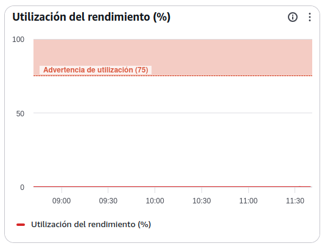
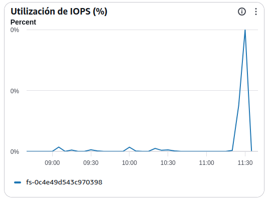
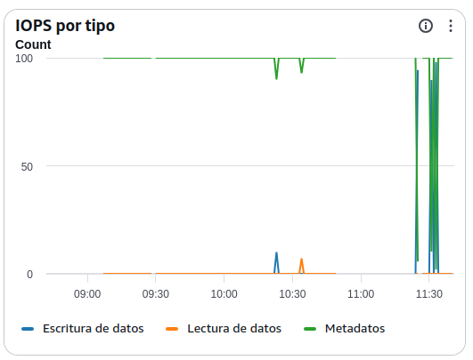
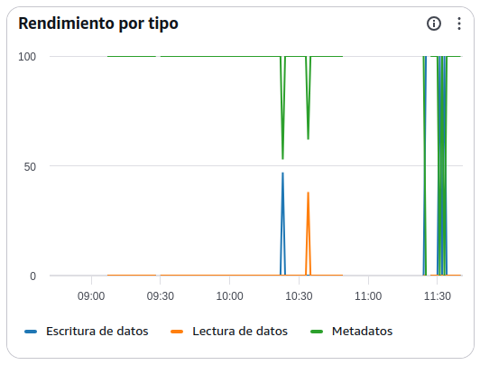
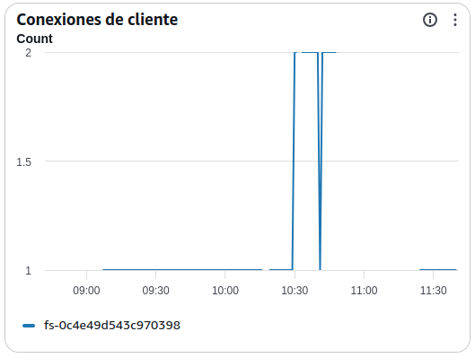
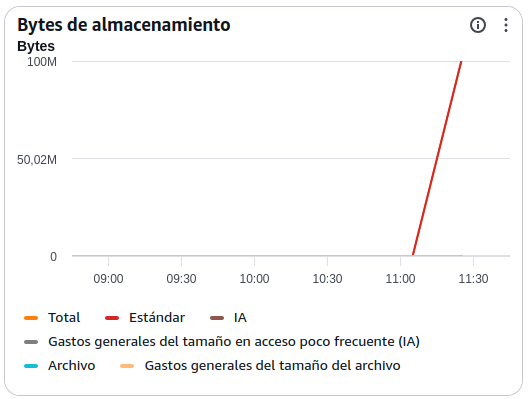

# Manual básico de supervisión de Amazon EFS (Elastic File System)

## AWS EFS Monitoring: Guía de Métricas para Operaciones

### Introducción

La supervisión de **Amazon EFS** permite controlar el rendimiento, capacidad y utilización del sistema de ficheros compartido.

**Objetivos del administrador SysOps:**

- Detectar cuellos de botella de rendimiento.
- Identificar saturación de IOPS o throughput.
- Controlar el crecimiento del almacenamiento.
- Optimizar costes.
- Garantizar la disponibilidad de las aplicaciones que utilizan EFS.

---

## 1. Utilización del rendimiento (%)

### ¿Qué mide?

Porcentaje de utilización del throughput disponible en el sistema EFS.

### Valores recomendados

| Valor          | Estado     |
| -------------- | ---------- |
| 0-50%          | Normal     |
| 50-75%         | Vigilancia |
| 75-90%         | Alto       |
| >90% sostenido | Crítico    |

### Qué revisar

- Aplicaciones con accesos intensivos.
- Procesos batch.
- Copias masivas de archivos.
- Procesos ETL.

### Penalizaciones

- Incremento de latencias.
- Degradación del acceso a ficheros.
- Necesidad de cambiar a modo Provisioned Throughput.

---

## 2. Utilización de IOPS (%)

### ¿Qué mide?

Porcentaje de operaciones de entrada/salida consumidas respecto al límite disponible.

### Valores recomendados

| Valor          | Estado     |
| -------------- | ---------- |
| 0-60%          | Normal     |
| 60-80%         | Vigilancia |
| 80-95%         | Alto       |
| >95% sostenido | Crítico    |

### Qué revisar

- Aplicaciones con muchos ficheros pequeños.
- Escaneos de directorios.
- Operaciones masivas de lectura/escritura.

### Penalizaciones

- Mayor tiempo de respuesta.
- Limitación de acceso a disco.
- Pérdida de rendimiento global.

---

## 3. IOPS por tipo

### ¿Qué mide?

Número de operaciones por segundo realizadas sobre el sistema.

Se divide normalmente en:

- Lecturas (Read)
- Escrituras (Write)
- Metadatos (Metadata)

### Qué revisar

#### Lecturas elevadas

Pueden indicar:

- Consultas frecuentes a datos compartidos.
- Aplicaciones sin caché.

#### Escrituras elevadas

Pueden indicar:

- Cargas masivas.
- Logs excesivos.
- Procesos batch.

#### Metadatos elevados

Pueden indicar:

- Directorios con muchos ficheros.
- Aplicaciones que realizan búsquedas constantes.

### Penalizaciones

- Consumo rápido de IOPS disponibles.
- Latencias más elevadas.

---

## 4. Rendimiento por tipo (Throughput)

### ¿Qué mide?

Cantidad de datos transferidos por segundo.

Se divide en:

- Lectura de datos.
- Escritura de datos.
- Operaciones de metadatos.

### Valores óptimos

Dependen completamente de la aplicación.

### Qué revisar

Picos de throughput pueden indicar:

- Copias masivas.
- Backups.
- Procesamiento de grandes volúmenes de información.

### Penalizaciones

- Saturación del throughput permitido.
- Accesos lentos a los ficheros.

---

## 5. Conexiones de cliente

### ¿Qué mide?

Número de clientes o instancias conectadas simultáneamente al sistema EFS.

### Valores recomendados

Amazon EFS soporta miles de conexiones, pero deben vigilarse aumentos anómalos.

### Qué revisar

- Nuevos servidores conectándose.
- Incrementos inesperados de consumo.
- Procesos que no desmontan correctamente el filesystem.

### Penalizaciones

- Incremento de carga en operaciones de metadatos.
- Posibles degradaciones de rendimiento.

---

## 6. Bytes de almacenamiento

### ¿Qué mide?

Cantidad total de datos almacenados en el sistema EFS.

Suele dividirse en:

- Standard
- Infrequent Access (IA)
- Archive

### Valores recomendados

Monitorizar tendencias de crecimiento más que valores absolutos.

### Qué revisar

- Crecimiento continuo.
- Archivos temporales no eliminados.
- Backups almacenados incorrectamente.

### Penalizaciones

- Incremento de costes.
- Consumo innecesario de almacenamiento premium.

---

### 6.1. Datos almacenados en Standard

#### ¿Qué mide?

Datos almacenados en la clase de almacenamiento de acceso frecuente.

#### Qué revisar

- Información activa de aplicaciones.
- Datos de uso diario.

#### Recomendación

Mover automáticamente datos poco utilizados a IA mediante Lifecycle Management.

---

### 6.2. Datos almacenados en IA (Infrequent Access)

#### ¿Qué mide?

Archivos accedidos con poca frecuencia.

#### Objetivo

Reducir costes manteniendo disponibilidad inmediata.

#### Qué revisar

- Volumen movido a IA.
- Eficacia de las políticas Lifecycle.

#### Penalizaciones

- Recuperaciones frecuentes pueden aumentar costes.

---

### 6.3. Datos almacenados en Archive

#### ¿Qué mide?

Información archivada de muy baja frecuencia de acceso.

#### Objetivo

Minimizar costes de almacenamiento.

#### Qué revisar

- Datos históricos.
- Retención documental.

#### Penalizaciones

- Mayor latencia de recuperación.

---

## Alertas recomendadas para producción

| Métrica                      | Alarma                                  |
| ---------------------------- | --------------------------------------- |
| Utilización del rendimiento  | >80% durante 15 min                     |
| Utilización de IOPS          | >80% durante 15 min                     |
| Conexiones de cliente        | Incremento anómalo sostenido            |
| Throughput lectura/escritura | Crecimiento no esperado                 |
| Bytes almacenados            | Crecimiento superior al previsto        |
| Datos Standard               | Incremento continuo sin movimiento a IA |
| Utilización del rendimiento  | >90% sostenido                          |

---

## Categorización

### Indicadores de rendimiento

- Utilización del rendimiento (%)
- Utilización de IOPS (%)
- IOPS por tipo
- Rendimiento por tipo (Throughput)

### Indicadores de capacidad

- Bytes de almacenamiento
- Conexiones de cliente

### Indicadores de costes

- Datos en Standard
- Datos en IA
- Datos en Archive
- Crecimiento del almacenamiento

### Indicadores de disponibilidad

- Utilización de rendimiento
- Utilización de IOPS
- Conexiones de cliente

---

## Indicadores de necesidad de escalado

Los indicadores que normalmente anticipan problemas de capacidad o rendimiento en EFS son:

- Utilización del rendimiento >80%.
- Utilización de IOPS >80%.
- Crecimiento acelerado del almacenamiento.
- Elevado número de operaciones de metadatos.
- Throughput cercano al máximo durante periodos prolongados.
- Incremento sostenido de latencia percibida por las aplicaciones.

**Observación sobre tu captura:** se aprecia una **utilización de rendimiento cercana al umbral de alarma (76%)**, mientras que la **utilización de IOPS permanece baja** y solo existen **2 clientes conectados**, lo que sugiere que el posible cuello de botella actual está más relacionado con el throughput que con el número de operaciones o conexiones. Además, el volumen almacenado es reducido (entorno de decenas de KB), por lo que no existe un problema de capacidad en almacenamiento.
